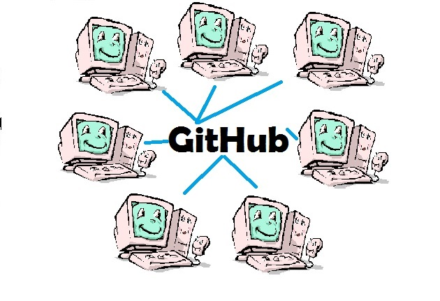

Kapita Selekta 
===============

**Capita Selecta**

**Latar Belakang **

Di jaman Yang semakin modern ini semakin banyaknya teknologi yang semakin berkembang sangat pesat terutama dalam hal sosial media terutama dalam dunia TI sosial media yang sekarang sedang dipakai dan diperbincangkan yaitu Github. Github merupakan repository sosial yang dibuat untuk membuat proyek-proyek open-source berbasis sistem dengan kendali versi Git. Jadi Github ini untuk mempermudah pengguna , github merupakan suatu tempat yang menyediakan untuk berbagi source code dengan pengguna yang lainnya. Dan kita juga bisa membuatnya menjadi milik kita sendiri dengan keamanan yang dapat kita buat sendiri.

**Background**

In this modern era of Its getting more and more technology is growing very rapidly, especially in terms of social media, especially in the IT world of social media that is currently being used and the discussion is Github. GitHub is a social repository created to make projects based open-source version control system Git. So this Github to simplify the user, github is a place that provides for sharing source code with other users. And we also can make it our own security to our own.

**ABOUT **

Nurpazrina 1144054

D4 Teknik Informatika 3B

Politeknik Pos Indonesia
